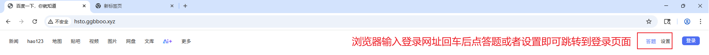
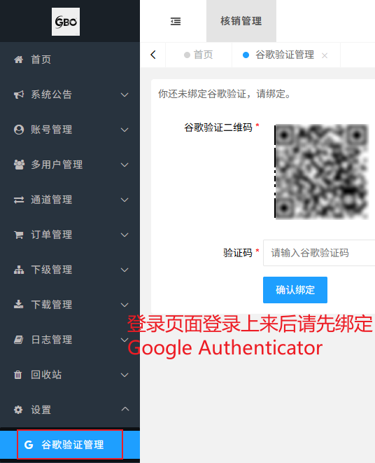
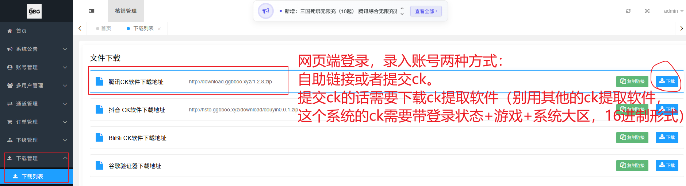
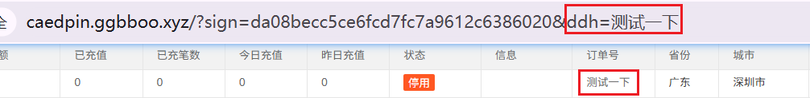
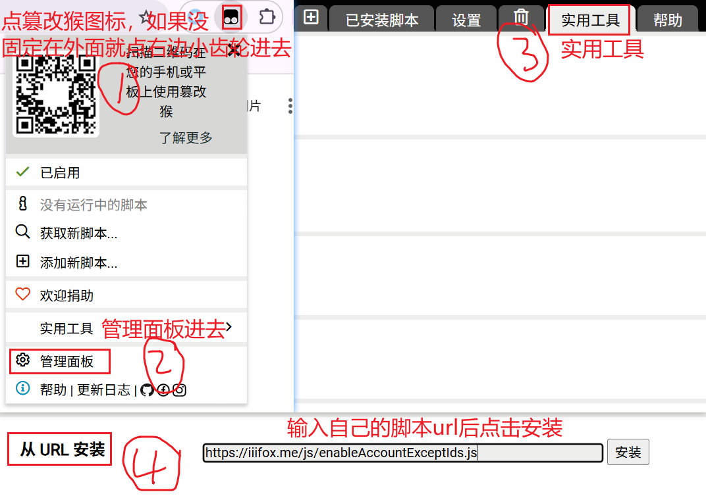
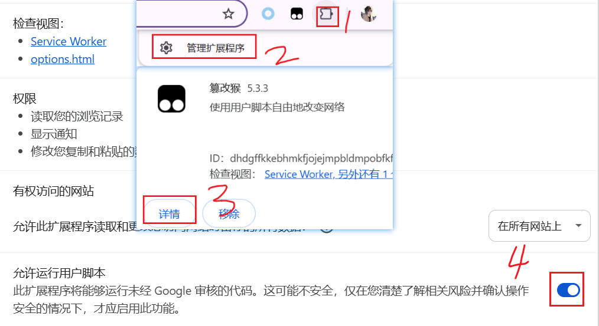

* 目录
{:toc}


## 登录下载

**进入登录页面**



设置答题都不见了；电脑点那两个地方没反应；www.baidu.com 拒绝连接。等所有情况，都只需要调出开发者工具（Ctrl+Shift+I或F12），点开Console(控制面板)，输入以下代码后回车即可
```javascript
showLogin()
```

**绑定身份验证器**



**下载提CK软件**



## 通道区分

用我的查价网址可看到每个价格对应哪些通道可挂（鼠标悬停会显示）。

打开CK提取软件 会告诉你要充的东西挂什么通道

## 挂号教程

首页或者通道管理当中找到你要挂的通道

- 添加账号：用提CK软件扫码(也可以放ck链接)获取CK，填写CK信息挂号
- 生成卡密：复制卡密发给客户，让客户扫码录入即可


注意：卡密最后的ddh参数为**订单号**，所以批量添加卡密也是可以配合阿奇索自动发货的（与小刀系统一样，订单号放在卡密链接最后）



## 自动启用

该系统有点抽风，长时间不拉单或者多次不支付都可能被自动停用，因此特地编写一个脚本（每3分钟自动检测一轮），可以自动启用那些没到限额限笔就被异常关闭的的账号id，脚本url如下：

```
https://api.luei.me/script/gboAutoEnable.js
```

你只需要使用[篡改猴](https://www.tampermonkey.net/)：**管理面板——实用工具——从URL导入**，输入上面的url地址即可。



需要注意的是，最新版本的Chrome浏览器默认关闭了篡改猴的**允许运行用户脚本**，你需要进入管理扩展程序——点击篡改猴详情，然后打开这个开关。


