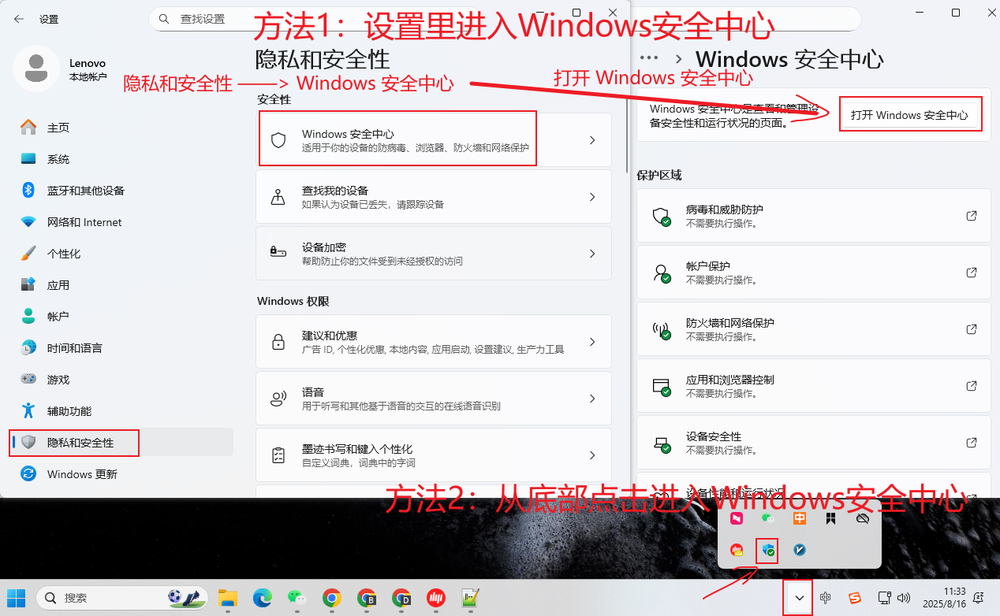
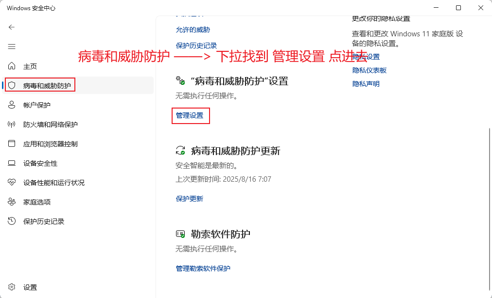
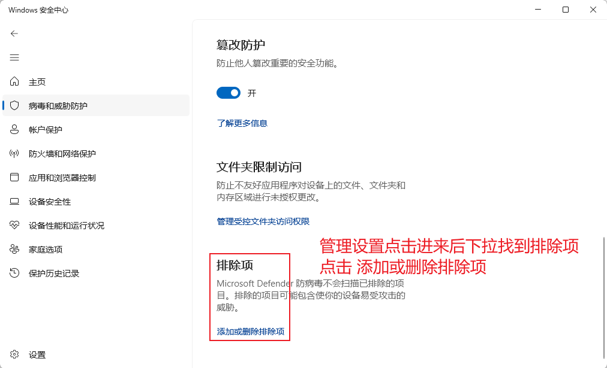
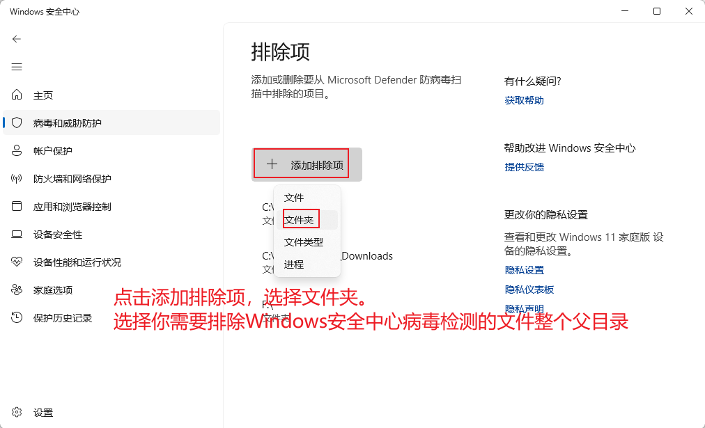
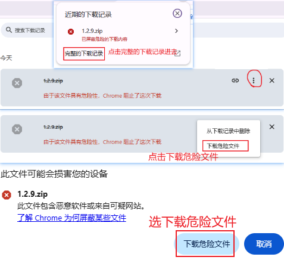
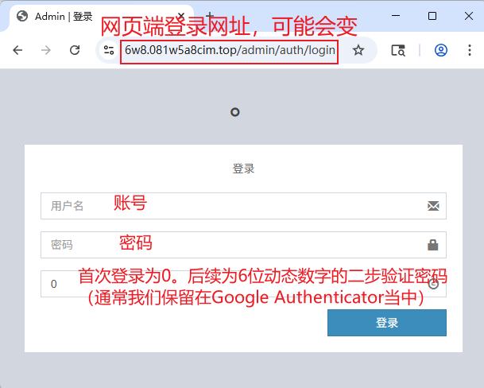
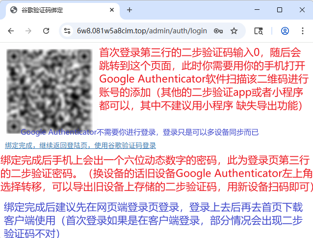
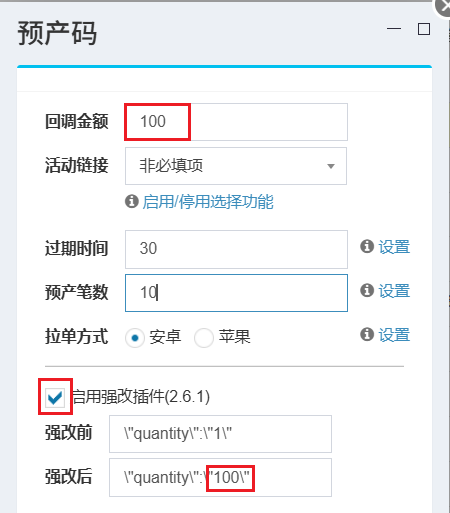

* 目录
{:toc}

# 电脑小白的常识课

## 手机端Google Authenticator安装

二步身份验证一律建议使用 Google Authenticator app来进行绑定，支持导出账号，其生成的二维码通过简单的编码可单独提取 totp_secret 参数，即使不直接提取 totp_secret 参数也可以使用其他设备的 Google Authenticator app扫描导出二维码进行绑定。如若使用小程序，则没有导出功能的

- [安卓手机下载链接](https://apkpure.com/cn/google-authenticator/com.google.android.apps.authenticator2)：默认下载的是最新版本，如若无法正常使用，请下拉下载历史版本。

- [苹果手机共享美区ID](https://ids.ailiao.eu/)：共享美区ID只需在App Store中登录 **切勿在系统设置中登录共享ID(iCloud)，否则有锁机风险**<br>
 [美区Google Authenticator](https://apps.apple.com/us/app/google-authenticator/id388497605)：点击链接即可跳转App Store下载，下载完成后记得退出共享美区ID账号
 

## 浏览器插件：篡改猴(脚本管理器)

- [AdblockPlus](https://adblockplus.org/zh_CN/)：浏览器广告拦截扩展
- [篡改猴](https://www.tampermonkey.net/)：浏览器脚本管理器，支持将自己编写的脚本注入网站

## Windows安全中心添加排除项

软件等被莫名杀毒，一般都是杀毒软件造成的，请先关闭（建议直接卸载）所有第三方杀毒软件，而后在Windows安全中心当中将其添加白名单

仅以Windows11系统为例，其他Windows系统可参考






## 浏览器已屏蔽危险的下载内容

仅以Chrome浏览器为例，其他浏览器类似。

点击网址栏右边下载按钮，如果出现无法下载可以直接选择保留就保留。如若只显示“已屏蔽危险的下载内容”，则按下面的步骤下载即可



# 小刀系统教程

## 登录下载

**首页网址**
```
https://rd10.8w0m6rjg3l.top/admin
```



**绑定谷歌**



网页端登录上去后，前往首页有一个“最新客户端下载：”，复制后面的URL，随后打开新标签页回车下载即可。

## 挂号流程

账号扫上之后开启拉单，点击预产 —— 拉单，然后等待到账即可。

不过由于目前码子基本都是2分钟有效期，所以一般来说都不会选用手动拉单的方式，而是配合系统自带的“直冲”。挂号之前先保证该账号只有当前设备上的客户端是开启弹窗的，流程为：账号扫上之后开启拉单，点击预产 —— 开启钱包直冲或者微信直冲，然后等待弹窗进行支付即可。

## 渠道区分

预产阶段回调金额即系统需扣款的额度，填写的是**单笔实际支付金额**往上取。比如单笔实付198，那么回调金额应该往上取到200

查价网站有写每个渠道所属的类型，分为：钱包、特殊、微信。一般情况下：钱包、特殊渠道支付方式均选择QQ钱包支付，相应的开的是钱包直冲；微信渠道支付方式选择微信支付，相应开的是微信直冲

- ABCDEF分别为不同的价格排序越后价格越贵速度越快（回调 100-2000 之间整百金额）
- H是偶尔会开的低价（回调 100-2000 之间整百金额）
- TA=特殊A TB=特殊B （特殊回调 328/348/648 这三个金额）
- VA=是微信渠道（回调 100-2000 之间整百金额）
- VB微信10起
- VC微信50
- VD100
- VE200

## 产码流程

通道管理（客户端）当中添加账号，随后去充值账号管理当中进行预产拉即可

- **手动产码**：预产 ——> 开启拉单 ——> 拉单
- **自动直拉**：需要确保有客户端登录，并且只有一个客户端开了自动弹窗，不要锁屏！
   - **全自动产码**：预产 ——> 开启拉单、开启自动直冲（仅无畏契约、DNF端游、LOL端游、K歌、心悦无畏、三角洲）
   - **半自动产码**：预产 ——> 开启拉单、开启自动直冲 ——> 等待弹窗手动拉码

> 首页：一般用于下载最新客户端，可查看部分历史版本的更新简述（网页端网址有变的话我会通知）
> 
> 充值账户管理：扫码或者自助链接录入上来的账号都会在这里显示，所有蓝色显示都可以双击进行修改
> 
> 下级账号管理：可以查看和设置下级的充值账户。如果你不是总台的话，也可在该页面给下级进行产码操作
> 
> 自助链接管理
> 
> 子账号管理：可查看自己的账户余额。手下级点添加码商，导出账单点快速对账（仅网页端支持导出）
> 
> 产码管理：你自己以及你所有下级所产出来的所有未失效码子均可在此查看。也可以点击QRCODE自己付款（一定要先关闭这个账号的拉单，否则系统100%强回）
> 
> 订单管理：这里可以查看余码以及每笔订单的支付情况。需要特别留意的是异常单，异常单系统不扣余额，需要额外记外账，折扣正常跟随渠道折扣走，部分情况原价，尽量不要刻意拉异常单
> 
> 活动链接管理：将自己的返利链接添加到这里，预产时就无需手动输入返利链接

## 强改插件

如果遇到无赠送且链接固定挡位不是整百的游戏，可以选择使用强改插件（否则比如实付198且无赠送的情况下回调200，其实是有亏损的）

强改的原理是腾讯的游戏默认直接支付的话都是“xx点券*1”，其中1是数量，即默认份数（数量）都是1，所以我们可以通过修改请求参数中的 quantity(数量) 达到修改实付金额的目的。比如回调 100元，但是链接不能自定义且固定挡位当中没有 100，这个时候我们可以选择将数量修改为 100，这个时候我们选择固定挡位当中的 1元 挡位，就会变成实付 100元。

1. 强改注意点：有赠送游戏的强改后无赠送
2. 如何启用强改：勾选启用强改插件 + 修改强改后的数量




## ~软件~

~由于种种原因，现已放开置顶，并提供自动置顶软件，下载链接在下方。需要注意的是软件使用须经我的授权，并且我在服务器端随时可能会终止软件的使用。另外，由于该系统服务器过于拉胯，不得已在v2.7版本取消了无限刷新功能，如被停用后确实还需要置顶，为了服务器考虑，请务必隔段时间再重启置顶（本打算停用后半小时或者多久不让置顶，一下限制太多也没必要，故v2.7版本没对这方面做限制）~

